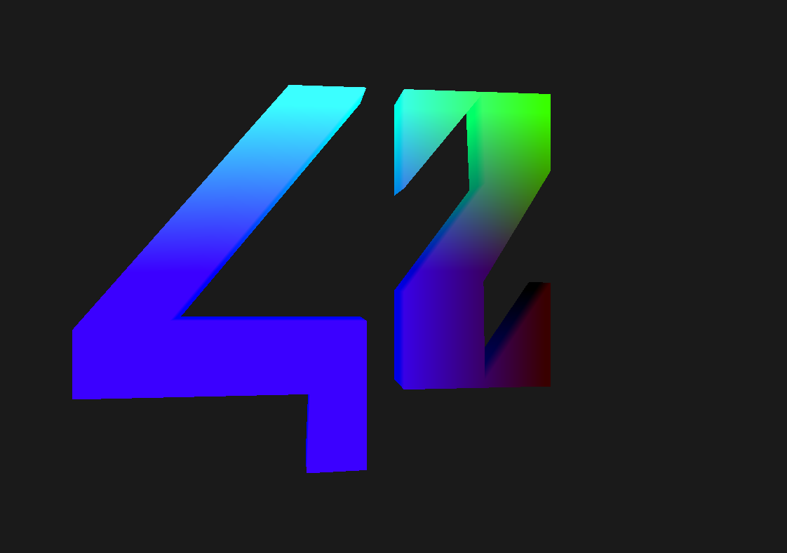
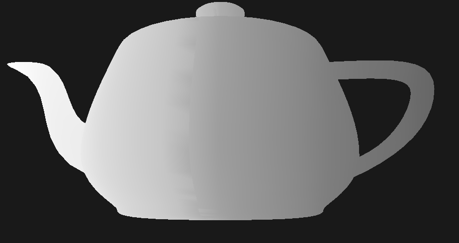
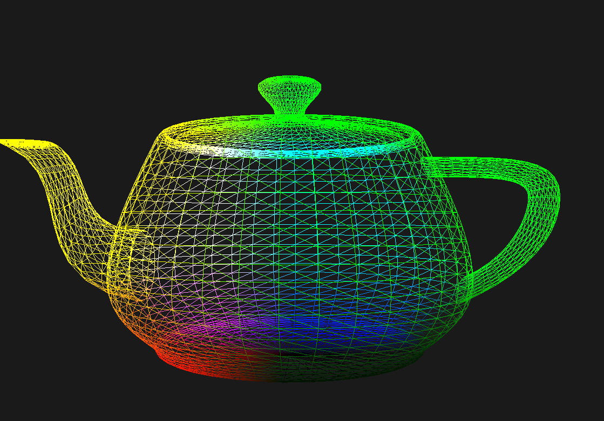
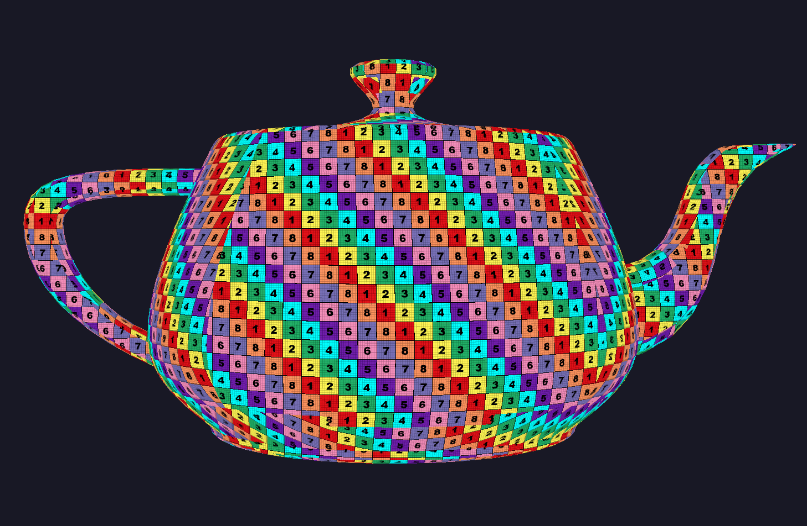

# SCOP
This program is designed to display a 3D object stored in a .obj file format.
The application renders the object in a window using OpenGL, allowing for rotation, translation along three axes, distinct side coloring, and texture application with a soft transition.

## How to Use
Compilation:
- Use the provided Makefile: `make`

Execution:
- `./SCOP <.obj>`

## Screenshots

## References
- [Wavefront .obj file - Wikipedia](https://en.wikipedia.org/wiki/Wavefront_.obj_file)
- [Learn OpenGL, extensive tutorial resource for learning Modern OpenGL](https://learnopengl.com/)

### Textures
- [Search Results on ambientCG](https://ambientcg.com/list?category=&date=&createdUsing=&basedOn=&q=&method=&type=&sort=Downloads)
